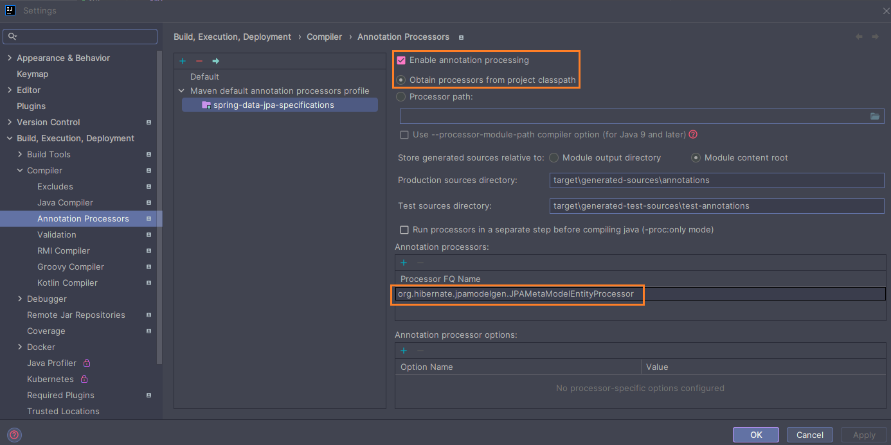

# [Dynamic Query with Specification Interface in Spring Data JPA](https://medium.com/@bubu.tripathy/dynamic-query-with-specification-interface-in-spring-data-jpa-ae8764e32162)

- Tutorial tomado de la página web **medium** del autor **Bubu Tripathy**
- Spring: [Specifications](https://docs.spring.io/spring-data/jpa/reference/jpa/specifications.html)
- Proyecto donde se usa **specifications**:
  [spring-boot-web-crud](https://github.com/magadiflo/spring-boot-web-crud.git)

---

## Dependencias

````xml
<!--Spring Boot 3.2.3-->
<!--Java 21-->
<dependencies>
    <dependency>
        <groupId>org.springframework.boot</groupId>
        <artifactId>spring-boot-starter-data-jpa</artifactId>
    </dependency>
    <dependency>
        <groupId>org.springframework.boot</groupId>
        <artifactId>spring-boot-starter-web</artifactId>
    </dependency>

    <dependency>
        <groupId>org.hibernate.orm</groupId>
        <artifactId>hibernate-jpamodelgen</artifactId>
    </dependency>
    <dependency>
        <groupId>com.mysql</groupId>
        <artifactId>mysql-connector-j</artifactId>
        <scope>runtime</scope>
    </dependency>
    <dependency>
        <groupId>org.projectlombok</groupId>
        <artifactId>lombok</artifactId>
        <optional>true</optional>
    </dependency>
    <dependency>
        <groupId>org.springframework.boot</groupId>
        <artifactId>spring-boot-starter-test</artifactId>
        <scope>test</scope>
    </dependency>
</dependencies>
````

## Propiedades

````yaml
server:
  port: 8080
  error:
    include-message: always

spring:
  application:
    name: spring-data-jpa-specifications

  datasource:
    url: jdbc:mysql://localhost:3306/db_spring_data_jpa
    username: admin
    password: magadiflo

  jpa:
    hibernate:
      ddl-auto: create-drop
    properties:
      hibernate:
        format_sql: true

logging:
  level:
    org.hibernate.SQL: DEBUG
````

## Entidades

````java

@NoArgsConstructor
@AllArgsConstructor
@Builder
@Data
@Entity
@Table(name = "departments")
public class Department {
    @Id
    @GeneratedValue(strategy = GenerationType.IDENTITY)
    private Long id;
    private String code;
    private String name;
    private String phoneNumber;
}
````

````java

@NoArgsConstructor
@AllArgsConstructor
@Builder
@Data
@Entity
@Table(name = "employees")
public class Employee {
    @Id
    @GeneratedValue(strategy = GenerationType.IDENTITY)
    private Long id;
    private String firstName;
    private String lastName;
    private String email;
    private String phoneNumber;
    private LocalDate hireDate;
    private Double salary;

    @ManyToOne
    @JoinColumn(name = "department_id")
    private Department department;
}
````

## Tablas generadas


## Repositorios

````java
public interface IDepartmentRepository extends JpaRepository<Department, Long> {
}
````

````java
public interface IEmployeeRepository extends JpaRepository<Employee, Long> {
}
````

## Servicios

````java
public interface IDepartmentService {
    List<Department> getAllDepartment();

    Optional<Department> getDepartment(Long departmentId);
}
````

````java

@RequiredArgsConstructor
@Slf4j
@Service
public class DepartmentServiceImpl implements IDepartmentService {

    private final IDepartmentRepository departmentRepository;

    @Override
    @Transactional(readOnly = true)
    public List<Department> getAllDepartment() {
        return this.departmentRepository.findAll();
    }

    @Override
    @Transactional(readOnly = true)
    public Optional<Department> getDepartment(Long departmentId) {
        return this.departmentRepository.findById(departmentId);
    }
}
````

````java
public interface IEmployeeService {
    List<Employee> getAllEmployees();

    Optional<Employee> getEmployee(Long employeeId);
}
````````

````java

@RequiredArgsConstructor
@Slf4j
@Service
public class EmployeeServiceImpl implements IEmployeeService {

    private final IEmployeeRepository employeeRepository;

    @Override
    @Transactional(readOnly = true)
    public List<Employee> getAllEmployees() {
        return this.employeeRepository.findAll();
    }

    @Override
    @Transactional(readOnly = true)
    public Optional<Employee> getEmployee(Long employeeId) {
        return this.employeeRepository.findById(employeeId);
    }
}
````

## Rest Controllers

````java

@RequiredArgsConstructor
@RestController
@RequestMapping(path = "/api/v1/departments")
public class DepartmentRestController {

    private final IDepartmentService departmentService;

    @GetMapping
    public ResponseEntity<List<Department>> getAllDepartment() {
        return ResponseEntity.ok(this.departmentService.getAllDepartment());
    }

    @GetMapping(path = "/{departmentId}")
    public ResponseEntity<Department> getDepartment(@PathVariable Long departmentId) {
        return this.departmentService.getDepartment(departmentId)
                .map(ResponseEntity::ok)
                .orElseGet(() -> ResponseEntity.notFound().build());
    }
}
````

````java

@RequiredArgsConstructor
@RestController
@RequestMapping(path = "/api/v1/employees")
public class EmployeeRestController {

    private final IEmployeeService employeeService;

    @GetMapping
    public ResponseEntity<List<Employee>> getAllEmployees() {
        return ResponseEntity.ok(this.employeeService.getAllEmployees());
    }

    @GetMapping(path = "/{employeeId}")
    public ResponseEntity<Employee> getEmployee(@PathVariable Long employeeId) {
        return this.employeeService.getEmployee(employeeId)
                .map(ResponseEntity::ok)
                .orElseGet(() -> ResponseEntity.notFound().build());
    }
}
````

---

# Trabajando con Specifications

---

`JPA 2` introduce una `API de criterios` que puede utilizar para crear consultas mediante programación. Al escribir un
`criteria`, define la cláusula `WHERE` de una consulta para una clase de dominio. Dando un paso atrás, estos criterios
pueden considerarse como un predicado sobre la entidad descrita por las restricciones de la `API de criterios de JPA`.

La interfaz de `Specification` en `Spring Data JPA` es una poderosa herramienta que permite a los desarrolladores crear
consultas dinámicas con predicados basados en criterios. Proporciona una forma flexible y expresiva de construir
consultas complejas en tiempo de ejecución, lo que le permite crear operaciones de recuperación de datos más avanzadas y
personalizables.

Con la interfaz `Specification`, puede definir conjuntos de criterios que especifican las condiciones que debe
satisfacer su consulta. Estos criterios se pueden combinar utilizando operadores lógicos como `AND` y `OR`, lo que le
permite crear una lógica de consulta compleja adaptada a los requisitos de su aplicación. Al utilizar la
interfaz `Specification`, puede evitar escribir múltiples métodos de consulta para diferentes combinaciones de criterios
de búsqueda, lo que da como resultado un código más limpio y fácil de mantener.

`Spring Data JPA` toma el concepto de `specification` del libro de Eric Evans, “Domain Driven Design”, siguiendo la
misma semántica y proporcionando una API para definir dichas especificaciones con la `API de criterios de JPA`. Para
admitir especificaciones, puede ampliar la interfaz de su repositorio con la interfaz `JpaSpecificationExecutor`, como
se muestra en el siguiente ejemplo:

````java
public interface IEmployeeRepository extends JpaRepository<Employee, Long>, JpaSpecificationExecutor<Employee> {
}
````

La interfaz de `Specification` se define de la siguiente manera:

````java
public interface Specification<T> {
    Predicate toPredicate(Root<T> root, CriteriaQuery<?> query, CriteriaBuilder builder);
}
````

La interfaz de `Specification` es parte del paquete `org.springframework.data.jpa.domain` y proporciona un método
único, `toPredicate`, que es responsable de construir los predicados basados en criterios. El método `toPredicate` toma
tres parámetros: `Root, CriteriaQuery y CriteriaBuilder`.

- El objeto `root` representa la entidad que se consulta y permite el acceso a sus atributos.
- El objeto `CriteriaQuery` define la estructura de la consulta y se puede utilizar para modificar los aspectos de la
  consulta, como ordenar y agrupar.
- El objeto `CriteriaBuilder` proporciona un conjunto de métodos para construir predicados basados en criterios.

## Creando clase para los Specifications

Una vez que haya configurado su proyecto y definido su entidad JPA, el siguiente paso es crear una clase separada
donde se implementen los `Specifications`. **Esta clase servirá como contenedor para definir los predicados de consulta
dinámica utilizando condiciones basadas en criterios.**

Ilustremos el proceso creando una clase de especificación llamada `EmployeeSpecifications` para la entidad `Employee`.

````java

@NoArgsConstructor(access = AccessLevel.PRIVATE)
@Slf4j
public class EmployeeSpecifications {

    public static Specification<Employee> hasFirstName(String firstName) {
        return (root, query, criteriaBuilder) -> criteriaBuilder.equal(root.get(Employee_.FIRST_NAME), firstName);
    }

    public static Specification<Employee> hasSalaryGreaterThan(Double salary) {
        return (root, query, criteriaBuilder) -> criteriaBuilder.greaterThan(root.get(Employee_.SALARY), salary);
    }

    public static Specification<Employee> hasDepartmentName(String departmentName) {
        return (root, query, criteriaBuilder) -> criteriaBuilder.equal(root.get(Employee_.DEPARTMENT).get(Department_.NAME), departmentName);
    }
}
````

**DONDE**

- `@NoArgsConstructor(access = AccessLevel.PRIVATE)`, usamos lombok para crear un constructor privado, ya que esta clase
  tendrá únicamente métodos estáticos. En realidad esto no tiene nada que ver con los specifications, solo es para
  asegurarnos que no se creen instancias de esta clase.

En la clase `EmployeeSpecifications`, definimos tres especificaciones: `hasFirstName`, `hasSalaryGreaterThan` y
el `hasDepartmentName`. Cada método de especificación devuelve una instancia de `Specification` que encapsula la lógica
de predicado basada en criterios.

En el método `hasFirstName`, utilizamos el método `criteriosBuilder.equal` para crear un predicado que verifica si el
valor del atributo `"firstName"` en la entidad coincide con el parámetro de `firstName` proporcionado.

De manera similar, en el método `hasSalaryGreaterThan`, utilizamos el método `criteriosBuilder.greaterThan` para
construir un predicado que verifica si el atributo `"salary"` en la entidad es mayor que el parámetro `salary` dado.

Finalmente, la especificación `hasDepartmentName` comprueba si el `"name"` del `"department"` del `employee` coincide
con el parámetro `departmentName` proporcionado. Accede al atributo de `name` de la asociación con `department`
mediante la expresión `root.get(Employee_.DEPARTMENT).get(Department_.NAME)`.

**NOTA**

Observemos que para acceder a los campos de la entidad `Employee` lo hacemos de la siguiente manera:

````
root.get(Employee_.FIRST_NAME)
root.get(Employee_.SALARY)
root.get(Employee_.DEPARTMENT).get(Department_.NAME)
````

El tipo `Employee_` es un tipo de **metamodelo** generado utilizando el `generador de metamodelo JPA`.
Entonces, la expresión `Employee_.FIRST_NAME` **supone que el `Employee` tiene un atributo llamado `"firstName"`**.

Si no hiciéramos uso del **metamodelo**, lo que haríamos sería escribir directamente el nombre del atributo de la
entidad como un String, tal como se ve abajo (ya que eso es lo que está ocurriendo realmente detrás de escena al
utilizar el **metamodelo**):

````
root.get("firstName")
root.get("salary")
root.get("department").get("name")
````

### [¿Por qué usar el metamodelo JPA?](https://www.baeldung.com/hibernate-criteria-queries-metamodel)

A menudo, cuando escribimos una consulta de criterios, necesitamos hacer referencia a clases de entidades y sus
atributos.

Ahora, **una de las formas de hacer esto es proporcionar los nombres de los atributos como strings.** Pero esto tiene
varias desventajas.

Por un lado, tenemos que buscar los nombres de los atributos de la entidad. Y, en caso de que se cambie el nombre de una
columna más adelante en el ciclo de vida del proyecto, tenemos que refactorizar cada consulta donde se utiliza el
nombre.

La comunidad introdujo el metamodelo JPA para evitar estos inconvenientes y proporcionar acceso estático a los metadatos
de las clases de entidades administradas.

### Generando clases de metamodelo JPA

A continuación, necesitamos generar las clases de metamodelo y, para ello, utilizaremos la herramienta generadora de
metamodelo proporcionada por JBoss. JBoss es solo una de las muchas herramientas disponibles para generar el metamodelo.
Otras herramientas adecuadas incluyen EclipseLink, OpenJPA y DataNucleus.

Para usar la herramienta JBoss, necesitamos agregar la última dependencia en nuestro archivo `pom.xml`, y la herramienta
generará las clases de metamodelo una vez que activemos el comando de compilación de maven.

En nuestro caso, la dependencia ya la habíamos agregado al inicio de la creación de este proyecto:

````xml

<dependency>
    <groupId>org.hibernate.orm</groupId>
    <artifactId>hibernate-jpamodelgen</artifactId>
</dependency>
````

[**NOTA (click aquí)**](https://dzone.com/articles/upgrade-guide-to-spring-boot-3-for-spring-data-jpa-3-and-querydsl-5)
> La dependencia usada es `compatible con la versión de Spring Boot 3 >=`, mientras que si usamos la versión de
> `Spring Boot 2.7.5 <=` se usa el mismo `artifactId` pero el groupId sería `<groupId>org.hibernate</groupId>`.

### Configurando metamodelo dento del IDE de IntelliJ IDEA

Tenga en cuenta que **debemos realizar una configuración en nuestro IDE** para que el procesador de anotaciones se
ejecute de manera correcta.

El nombre completo del procesador en sí es: `org.hibernate.jpamodelgen.JPAMetaModelEntityProcessor`.

Por supuesto, también querrás tener disponible el procesamiento de anotaciones en tu IDE favorito. Los siguientes
párrafos y capturas de pantalla le muestran cómo habilitar el Generador de metamodelo estático de Hibernate dentro de su
IDE.

Intellij Idea contiene desde la versión 9.x en adelante una sección de configuración específica para el procesamiento de
anotaciones en la ventana de configuración del proyecto.

**A continuación se muestra cómo configurar el Generador de metamodelo estático de Hibernate.**

- A este proyecto ya le había habilitado el **generador de metamodelo**, pero olvidé tomarle captura de los cambios que
  hice para documentarlo, así que, a modo de repaso mestro la imagen de los pasos que seguí y el nombre del procesador
  que agregué, que precisamente es el que menciono en el párrafo superior:

  

- Una vez configurado el proyecto, damos **click secundario** al archivo `pom.xml`, `Maven/Reload project`.

- Ahora, hay que generar el directorio `/target`, ya que dentro de ese directorio estarán los metamodelos
  almacenados en el directorio `/generated-sources`. Para eso podemos ejecutar la aplicación o el siguiente comando en
  la raíz del proyecto:

  ````bash
  $ mvnw clean package -DskipTests
  ````

Listo, luego de haber realizado la configuración del metamodelo dentro de nuestro IDE IntelliJ IDEA, ya podemos
los metamodelos de nuestras entidades de la siguiente manera:

````
Employee_.SALARY
````

### Clases estáticas de metamodelo JPA

Según la especificación JPA, una clase generada residirá en el mismo paquete que la clase de entidad correspondiente y
tendrá el mismo nombre con un `"_"` (guión bajo) agregado al final. Entonces, la clase de metamodelo generada para la
clase `Employee` será `Employee_` y se verá así:

Ruta del metamodelo Employee_:

````bash
target/generated-sources/annotations/dev/magadiflo/specifications/app/persistence/entity/Employee_.java
````

````java
package dev.magadiflo.specifications.app.persistence.entity;

import jakarta.annotation.Generated;
import jakarta.persistence.metamodel.EntityType;
import jakarta.persistence.metamodel.SingularAttribute;
import jakarta.persistence.metamodel.StaticMetamodel;

import java.time.LocalDate;

@StaticMetamodel(Employee.class)
@Generated("org.hibernate.jpamodelgen.JPAMetaModelEntityProcessor")
public abstract class Employee_ {

    public static volatile SingularAttribute<Employee, String> firstName;
    public static volatile SingularAttribute<Employee, String> lastName;
    public static volatile SingularAttribute<Employee, LocalDate> hireDate;
    public static volatile SingularAttribute<Employee, String> phoneNumber;
    public static volatile SingularAttribute<Employee, Long> id;
    public static volatile SingularAttribute<Employee, Double> salary;
    public static volatile SingularAttribute<Employee, Department> department;
    public static volatile EntityType<Employee> class_;
    public static volatile SingularAttribute<Employee, String> email;

    public static final String FIRST_NAME = "firstName";
    public static final String LAST_NAME = "lastName";
    public static final String HIRE_DATE = "hireDate";
    public static final String PHONE_NUMBER = "phoneNumber";
    public static final String ID = "id";
    public static final String SALARY = "salary";
    public static final String DEPARTMENT = "department";
    public static final String EMAIL = "email";
}
````

## Repository: Extendiendo JpaSpecificationExecutor

Como vamos a trabajar con `Specifications`, necesitamos extender en el repositorio `IEmployeeRepository` la interfaz
`JpaSpecificationExecutor`, que es una interfaz que permitir la ejecución de `Specifications` basadas en el
`JPA criteria API`:

````java
public interface IEmployeeRepository extends JpaRepository<Employee, Long>, JpaSpecificationExecutor<Employee> {
}
````

## Clase de Servicio: Usando Specifications

En nuestra clase de servicio crearemos un método que usará las especificaciones que hemos definido:

````java
public interface IEmployeeService {
    /* other methods */
    Page<Employee> searchEmployees(String firstName, Double minSalary, String departmentName, Pageable pageable);
}
````

El método creado nos va a permitir hacer una búsqueda de empleados de acuerdo a ciertas condiciones, por ejemplo,
teniendo en cuenta el `firstName`, el `minSalary` y el `departmentName`. El resultado que mostremos al cliente
estará paginado:

````java

@RequiredArgsConstructor
@Slf4j
@Service
public class EmployeeServiceImpl implements IEmployeeService {

    private final IEmployeeRepository employeeRepository;

    /* other methods */

    @Override
    public Page<Employee> searchEmployees(String firstName, Double minSalary, String departmentName, Pageable pageable) {
        Specification<Employee> employeeSpec = Specification.where(null);

        if (StringUtils.hasText(firstName)) {
            employeeSpec = employeeSpec.and(EmployeeSpecifications.hasFirstName(firstName));
        }

        if (Objects.nonNull(minSalary) && minSalary > 0) {
            employeeSpec = employeeSpec.and(EmployeeSpecifications.hasSalaryGreaterThan(minSalary));
        }

        if (StringUtils.hasText(departmentName)) {
            employeeSpec = employeeSpec.and(EmployeeSpecifications.hasDepartmentName(departmentName));
        }

        return this.employeeRepository.findAll(employeeSpec, pageable);
    }
}
````

En este ejemplo, la clase `EmployeeServiceImpl` demuestra cómo utilizar la clase `EmployeeSpecifications` para realizar
consultas dinámicas en la entidad `Employee`.

El método `searchEmployees` toma varios parámetros de búsqueda, como `firstName`, `minSalary`, `departmentName`
y `pageable`. Construye la especificación de consulta dinámica en función de los parámetros proporcionados.

La especificación inicial se establece en `Specification.where(null)` para comenzar con un predicado neutral. Luego, si
se proporcionan los parámetros de búsqueda correspondientes, las especificaciones relevantes de la
clase `EmployeeSpecifications` se agregan a la especificación existente utilizando el método `and`. Esto permite
combinar las especificaciones utilizando condiciones lógicas `AND`.

Finalmente, se llama al método `employeeRepository.findAll(employeeSpec, pageable)` para ejecutar la consulta dinámica
utilizando la especificación construida y recuperar los resultados de forma paginada.

### Conclusión

Al implementar la interfaz `Specification`, puede definir una clase separada para encapsular los predicados basados en
criterios. Este enfoque promueve la modularidad, la reutilización y la mantenibilidad del código. La
clase contenedora le permite definir varias especificaciones, cada una de las cuales representa una condición
específica o una combinación de condiciones para sus consultas dinámicas.

## RestControllers

Finalmente, creamos el endpoint que usaremos para llamar al método del servicio que usa las especificaciones que hemos
creado hasta este punto:

````java

@RequiredArgsConstructor
@RestController
@RequestMapping(path = "/api/v1/employees")
public class EmployeeRestController {

    private final IEmployeeService employeeService;

    /* other methods */

    @GetMapping(path = "/search-specifications")
    public ResponseEntity<Page<Employee>> searchEmployees(
            @RequestParam(required = false) String firstName,
            @RequestParam(required = false) Double minSalary,
            @RequestParam(required = false) String departmentName,
            @RequestParam(required = false, defaultValue = "0") int pageNumber,
            @RequestParam(required = false, defaultValue = "5") int pageSize,
            @SortDefault(sort = "id", direction = Sort.Direction.ASC) Sort sort) {

        Pageable pageable = PageRequest.of(pageNumber, pageSize, sort);
        return ResponseEntity.ok(this.employeeService.searchEmployees(firstName, minSalary, departmentName, pageable));
    }
}
````

## Ejecutando aplicación

Al consultar el endpoint sin enviar parámetros, vemos que nos retorna los elementos sin ninguna restricción de búsqueda
y totalmente paginados:

````bash
$ curl -v http://localhost:8080/api/v1/employees/search-specifications | jq

>
< HTTP/1.1 200
<
{
  "content": [
    {
      "id": 1,
      "firstName": "Martín",
      "lastName": "Almagro",
      "email": "almagro@gmail.com",
      "phoneNumber": "963258969",
      "hireDate": "2015-03-01",
      "salary": 5000,
      "department": {
        "id": 1,
        "code": "D01",
        "name": "Sistemas",
        "phoneNumber": "332636"
      }
    },
    {
      "id": 2,
      "firstName": "Lucía",
      "lastName": "Campos",
      "email": "lucia@gmail.com",
      "phoneNumber": "985478969",
      "hireDate": "2020-05-15",
      "salary": 2500,
      "department": {
        "id": 1,
        "code": "D01",
        "name": "Sistemas",
        "phoneNumber": "332636"
      }
    },
    {
      "id": 3,
      "firstName": "Arely",
      "lastName": "Caldas",
      "email": "arely@gmail.com",
      "phoneNumber": "985965896",
      "hireDate": "2002-12-08",
      "salary": 3650,
      "department": {
        "id": 2,
        "code": "D02",
        "name": "Administración",
        "phoneNumber": "325089"
      }
    },
    {
      "id": 4,
      "firstName": "Marilyn",
      "lastName": "Pérez",
      "email": "mperez@gmail.com",
      "phoneNumber": "963258979",
      "hireDate": "2015-09-10",
      "salary": 2000,
      "department": {
        "id": 1,
        "code": "D01",
        "name": "Sistemas",
        "phoneNumber": "332636"
      }
    },
    {
      "id": 5,
      "firstName": "Liz",
      "lastName": "Gonzales",
      "email": "mgonzales@gmail.com",
      "phoneNumber": "953689596",
      "hireDate": "2014-03-01",
      "salary": 1855,
      "department": {
        "id": 3,
        "code": "D03",
        "name": "Contabilidad",
        "phoneNumber": "332514"
      }
    }
  ],
  "pageable": {
    "pageNumber": 0,
    "pageSize": 5,
    "sort": {
      "empty": false,
      "sorted": true,
      "unsorted": false
    },
    "offset": 0,
    "unpaged": false,
    "paged": true
  },
  "last": false,
  "totalElements": 11,
  "totalPages": 3,
  "size": 5,
  "number": 0,
  "sort": {
    "empty": false,
    "sorted": true,
    "unsorted": false
  },
  "first": true,
  "numberOfElements": 5,
  "empty": false
}
````

Buscamos todos los empleados que tengan el nombre de Liz:

````bash
$ curl -v -G --data "firstName=Liz" http://localhost:8080/api/v1/employees/search-specifications | jq

>
< HTTP/1.1 200
<
{
  "content": [
    {
      "id": 5,
      "firstName": "Liz",
      "lastName": "Gonzales",
      "email": "mgonzales@gmail.com",
      "phoneNumber": "953689596",
      "hireDate": "2014-03-01",
      "salary": 1855,
      "department": {
        "id": 3,
        "code": "D03",
        "name": "Contabilidad",
        "phoneNumber": "332514"
      }
    },
    {
      "id": 9,
      "firstName": "Liz",
      "lastName": "Azaña",
      "email": "estela@gmail.com",
      "phoneNumber": "943852525",
      "hireDate": "2020-03-15",
      "salary": 2600,
      "department": {
        "id": 4,
        "code": "D04",
        "name": "Recursos Humanos",
        "phoneNumber": "378965"
      }
    }
  ],
  "pageable": {
    "pageNumber": 0,
    "pageSize": 5,
    "sort": {
      "empty": false,
      "sorted": true,
      "unsorted": false
    },
    "offset": 0,
    "unpaged": false,
    "paged": true
  },
  "last": true,
  "totalElements": 2,
  "totalPages": 1,
  "size": 5,
  "number": 0,
  "sort": {
    "empty": false,
    "sorted": true,
    "unsorted": false
  },
  "first": true,
  "numberOfElements": 2,
  "empty": false
}
````

Buscamos todos los empleados que estén en el departamento de Sistemas:

````bash
$ curl -v -G --data "departmentName=Sistemas" http://localhost:8080/api/v1/employees/search-specifications | jq

>
< HTTP/1.1 200
<
{
  "content": [
    {
      "id": 1,
      "firstName": "Martín",
      "lastName": "Almagro",
      "email": "almagro@gmail.com",
      "phoneNumber": "963258969",
      "hireDate": "2015-03-01",
      "salary": 5000,
      "department": {
        "id": 1,
        "code": "D01",
        "name": "Sistemas",
        "phoneNumber": "332636"
      }
    },
    {
      "id": 2,
      "firstName": "Lucía",
      "lastName": "Campos",
      "email": "lucia@gmail.com",
      "phoneNumber": "985478969",
      "hireDate": "2020-05-15",
      "salary": 2500,
      "department": {
        "id": 1,
        "code": "D01",
        "name": "Sistemas",
        "phoneNumber": "332636"
      }
    },
    {
      "id": 4,
      "firstName": "Marilyn",
      "lastName": "Pérez",
      "email": "mperez@gmail.com",
      "phoneNumber": "963258979",
      "hireDate": "2015-09-10",
      "salary": 2000,
      "department": {
        "id": 1,
        "code": "D01",
        "name": "Sistemas",
        "phoneNumber": "332636"
      }
    }
  ],
  "pageable": {
    "pageNumber": 0,
    "pageSize": 5,
    "sort": {
      "empty": false,
      "sorted": true,
      "unsorted": false
    },
    "offset": 0,
    "unpaged": false,
    "paged": true
  },
  "last": true,
  "totalElements": 3,
  "totalPages": 1,
  "size": 5,
  "number": 0,
  "sort": {
    "empty": false,
    "sorted": true,
    "unsorted": false
  },
  "first": true,
  "numberOfElements": 3,
  "empty": false
}
````

Buscar todos los empleados que estén en el departamento de Sistemas y cuyo salario sea mayor a 3000:

````bash
$ curl -v -G --data "minSalary=3000&departmentName=Sistemas" http://localhost:8080/api/v1/employees/search-specifications | jq

>
< HTTP/1.1 200
<
{
  "content": [
    {
      "id": 1,
      "firstName": "Martín",
      "lastName": "Almagro",
      "email": "almagro@gmail.com",
      "phoneNumber": "963258969",
      "hireDate": "2015-03-01",
      "salary": 5000,
      "department": {
        "id": 1,
        "code": "D01",
        "name": "Sistemas",
        "phoneNumber": "332636"
      }
    }
  ],
  "pageable": {
    "pageNumber": 0,
    "pageSize": 5,
    "sort": {
      "empty": false,
      "sorted": true,
      "unsorted": false
    },
    "offset": 0,
    "unpaged": false,
    "paged": true
  },
  "last": true,
  "totalElements": 1,
  "totalPages": 1,
  "size": 5,
  "number": 0,
  "sort": {
    "empty": false,
    "sorted": true,
    "unsorted": false
  },
  "first": true,
  "numberOfElements": 1,
  "empty": false
}
````

## Creando otro ejemplo de Specification

````java

@NoArgsConstructor(access = AccessLevel.PRIVATE)
@Slf4j
public class EmployeeSpecifications {
    /* other methods */
    public static Specification<Employee> hasAHiringDateGreaterThanXYears(Integer xYears) {
        return (root, query, criteriaBuilder) -> {
            LocalDate localDate = LocalDate.now().minusYears(xYears);
            log.info("Fecha actual: {}, Años de antigüedad mayor a: {}", LocalDate.now(), xYears);
            return criteriaBuilder.lessThan(root.get(Employee_.HIRE_DATE), localDate);
        };
    }
}
````

````java
public interface IEmployeeService {
    /* other codes */
    Page<Employee> searchEmployees(Integer xYears, String departmentName, Pageable pageable);
}
````

````java

@RequiredArgsConstructor
@Slf4j
@Service
public class EmployeeServiceImpl implements IEmployeeService {
    /* other codes */
    @Override
    public Page<Employee> searchEmployees(Integer xYears, String departmentName, Pageable pageable) {
        Specification<Employee> employeeSpec = Specification.where(null);

        // Suponiendo que la lógica de negocio dice que los xYears deben estar entre [1 - 20] años
        if (Objects.nonNull(xYears) && xYears <= 20 && xYears >= 1) {
            employeeSpec = employeeSpec.and(EmployeeSpecifications.hasAHiringDateGreaterThanXYears(xYears));
        }

        if (StringUtils.hasText(departmentName)) {
            employeeSpec = employeeSpec.and(EmployeeSpecifications.hasDepartmentName(departmentName));
        }

        return this.employeeRepository.findAll(employeeSpec, pageable);
    }
}
````

````java

@RequiredArgsConstructor
@RestController
@RequestMapping(path = "/api/v1/employees")
public class EmployeeRestController {
    /* other methods */
    @GetMapping(path = "/search-old-employees")
    public ResponseEntity<Page<Employee>> searchEmployees(
            @RequestParam(required = false) Integer xYears,
            @RequestParam(required = false) String departmentName,
            @RequestParam(required = false, defaultValue = "0") int pageNumber,
            @RequestParam(required = false, defaultValue = "5") int pageSize,
            @SortDefault(sort = "id", direction = Sort.Direction.ASC) Sort sort) {

        Pageable pageable = PageRequest.of(pageNumber, pageSize, sort);
        return ResponseEntity.ok(this.employeeService.searchEmployees(xYears, departmentName, pageable));
    }
}
````

````bash
$ curl -v -G --data "xYears=20" http://localhost:8080/api/v1/employees/search-old-employees | jq

>
< HTTP/1.1 200
<
{
  "content": [
    {
      "id": 3,
      "firstName": "Arely",
      "lastName": "Caldas",
      "email": "arely@gmail.com",
      "phoneNumber": "985965896",
      "hireDate": "2002-12-08",
      "salary": 3650,
      "department": {
        "id": 2,
        "code": "D02",
        "name": "Administración",
        "phoneNumber": "325089"
      }
    }
  ],
  "pageable": {
    "pageNumber": 0,
    "pageSize": 5,
    "sort": {
      "empty": false,
      "sorted": true,
      "unsorted": false
    },
    "offset": 0,
    "unpaged": false,
    "paged": true
  },
  "last": true,
  "totalPages": 1,
  "totalElements": 1,
  "size": 5,
  "number": 0,
  "sort": {
    "empty": false,
    "sorted": true,
    "unsorted": false
  },
  "numberOfElements": 1,
  "first": true,
  "empty": false
}
````

## Creando otro ejemplo adicional de Specification

En los ejemplos anteriores la lógica de creación del criterio de búsqueda lo hacíamos en la clase de servicio, en este
ejemplo vemos que estamos colocando toda la lógica dentro del mismo método de especificación. El único propósito es
para ver el uso de otros métodos como el `conjuntion()`, `disjuntion()`, `orderBy`, `desc`, `asc`, etc. y ver cómo
estos métodos trabajan en conjunto. Pero:

> Sería recomendable (según yo), definir cada método estático de especificación que haga una sola tarea, por ejemplo,
> ver que el `hireDate` esté entres dos rangos de fecha, etc., tal como lo hemos venido haciendo en métodos anteriores,
> de esa forma, podríamos reutilizar estos métodos para elaborar nuevas condiciones de consulta.

````java

@NoArgsConstructor(access = AccessLevel.PRIVATE)
@Slf4j
public class EmployeeSpecifications {
    /* other methods */
    public static Specification<Employee> hasHireDateBetweenTwoDatesOrGetByDepartmentName(LocalDate initialDate, String firstName, String departmentName) {
        return (root, query, criteriaBuilder) -> {
            /**
             * criteriaBuilder.conjunction(), crea una conjunción (con cero conjunciones).
             * Una conjunción con cero conjunciones es verdadera.
             *
             * criteriaBuilder.disjunction(), crea una disyunción (con cero disyunciones).
             * Una disyunción con cero disyunciones es falsa.
             *
             * Predicate, el tipo de predicado simple o compuesto: una conjunción o disyunción de restricciones.
             * Se considera que un predicado simple es una conjunción con una sola conjunción.
             */
            Predicate conjunction = criteriaBuilder.conjunction(); // 1=1
            Predicate disjunction = criteriaBuilder.disjunction(); // 1<>1
            LocalDate currentDate = LocalDate.now();

            log.info("{} es menor que la fecha actual {}", initialDate, currentDate);

            if (Objects.nonNull(initialDate) && initialDate.isBefore(currentDate)) {
                Predicate between = criteriaBuilder.between(root.get(Employee_.HIRE_DATE), initialDate, currentDate);
                conjunction = criteriaBuilder.and(conjunction, between);
            }

            if (StringUtils.hasText(firstName)) {
                Predicate like = criteriaBuilder.like(root.get(Employee_.FIRST_NAME), "%" + firstName + "%");
                conjunction = criteriaBuilder.and(conjunction, like);
            }

            if (StringUtils.hasText(departmentName)) {
                Predicate equal = criteriaBuilder.equal(root.get(Employee_.DEPARTMENT).get(Department_.NAME), departmentName);
                disjunction = criteriaBuilder.or(disjunction, equal);
            }

            query.orderBy(
                    criteriaBuilder.desc(root.get(Employee_.FIRST_NAME)),
                    criteriaBuilder.asc(root.get(Employee_.ID))
            );

            return criteriaBuilder.or(conjunction, disjunction);
        };
    }
}
````

````java
public interface IEmployeeService {
    List<Employee> searchEmployees(LocalDate initialDate, String firstName, String departmentName);
}
````

````java

@RequiredArgsConstructor
@Slf4j
@Service
public class EmployeeServiceImpl implements IEmployeeService {
    /* other methods */
    @Override
    public List<Employee> searchEmployees(LocalDate initialDate, String firstName, String departmentName) {
        Specification<Employee> specification = EmployeeSpecifications.hasHireDateBetweenTwoDatesOrGetByDepartmentName(initialDate, firstName, departmentName);
        return this.employeeRepository.findAll(specification);
    }
}
````

````java

@RequiredArgsConstructor
@RestController
@RequestMapping(path = "/api/v1/employees")
public class EmployeeRestController {
    /* other methods */
    @GetMapping(path = "/search-no-pagination")
    public ResponseEntity<List<Employee>> searchEmployees(
            @RequestParam(required = false) LocalDate initialDate,
            @RequestParam(required = false) String firstName,
            @RequestParam(required = false) String departmentName) {

        return ResponseEntity.ok(this.employeeService.searchEmployees(initialDate, firstName, departmentName));
    }
}
````

La consulta principal generada en consola es la siguiente:

````bash
2024-03-01T12:23:54.366-05:00  INFO 10540 --- [spring-data-jpa-specifications] [nio-8080-exec-3] d.m.s.a.p.r.s.EmployeeSpecifications     : 2019-01-01 es menor que la fecha actual 2024-03-01
2024-03-01T12:23:54.371-05:00 DEBUG 10540 --- [spring-data-jpa-specifications] [nio-8080-exec-3] org.hibernate.SQL                        : 
    select
        e1_0.id,
        e1_0.department_id,
        e1_0.email,
        e1_0.first_name,
        e1_0.hire_date,
        e1_0.last_name,
        e1_0.phone_number,
        e1_0.salary 
    from
        employees e1_0 
    join
        departments d1_0 
            on d1_0.id=e1_0.department_id 
    where
        1=1 
        and e1_0.hire_date between ? and ? 
        and e1_0.first_name like replace(?, '\\', '\\\\') 
        or 1<>1 
        or d1_0.name=? 
    order by
        e1_0.first_name desc,
        e1_0.id
````

De la consulta anterior, lo más interesante es la sección del `WHERE`, ya que aquí vemos cómo es que se ha generado
el criterio de búsqueda. Si analizamos el método de especificación `hasHireDateBetweenTwoDatesOrGetByDepartmentName`,
veremos que coincide exactamente como lo hemos definido:

````SQL
where
  1=1 
  and e1_0.hire_date between ? and ? 
  and e1_0.first_name like replace(?, '\\', '\\\\') 
  or 1<>1 
  or d1_0.name=? 
````

El SQL principal generado anteriormente surge a partir de haber realizado la siguiente request (hay otro select que se
genera pero es para buscar los departamentos, en este caso solo muestro en la parte superior el SQL principal):

````bash
$ curl -v -G --data "initialDate=2019-01-01&firstName=Liz&departmentName=Soporte" http://localhost:8080/api/v1/employees/search-no-pagination | jq

>
< HTTP/1.1 200
<
[
  {
    "id": 9,
    "firstName": "Liz",
    "lastName": "Azaña",
    "email": "estela@gmail.com",
    "phoneNumber": "943852525",
    "hireDate": "2020-03-15",
    "salary": 2600,
    "department": {
      "id": 4,
      "code": "D04",
      "name": "Recursos Humanos",
      "phoneNumber": "378965"
    }
  },
  {
    "id": 11,
    "firstName": "Judith",
    "lastName": "Alegría",
    "email": "ciro@gmail.com",
    "phoneNumber": "943851697",
    "hireDate": "2015-03-29",
    "salary": 5455,
    "department": {
      "id": 5,
      "code": "D05",
      "name": "Soporte",
      "phoneNumber": "321478"
    }
  }
]
````

Qué pasa si mandamos un request sin ningún parámetro:

````bash
$ curl -v http://localhost:8080/api/v1/employees/search-no-pagination | jq

>
< HTTP/1.1 200
<
[
  {
    "id": 10,
    "firstName": "Pedro",
    "lastName": "Alcántara",
    "email": "palcantara@gmail.com",
    "phoneNumber": "948751523",
    "hireDate": "2015-12-28",
    "salary": 3600,
    "department": {
      "id": 4,
      "code": "D04",
      "name": "Recursos Humanos",
      "phoneNumber": "378965"
    }
  },
  {...}
  {
    "id": 3,
    "firstName": "Arely",
    "lastName": "Caldas",
    "email": "arely@gmail.com",
    "phoneNumber": "985965896",
    "hireDate": "2002-12-08",
    "salary": 3650,
    "department": {
      "id": 2,
      "code": "D02",
      "name": "Administración",
      "phoneNumber": "325089"
    }
  }
]
````

Como vemos, el request nos trae todos los registros de empleados. La consulta SQL principal generada en consola es:

````bash
select
        e1_0.id,
        e1_0.department_id,
        e1_0.email,
        e1_0.first_name,
        e1_0.hire_date,
        e1_0.last_name,
        e1_0.phone_number,
        e1_0.salary 
    from
        employees e1_0 
    where
        1=1 
        or 1<>1 
    order by
        e1_0.first_name desc,
        e1_0.id
````
