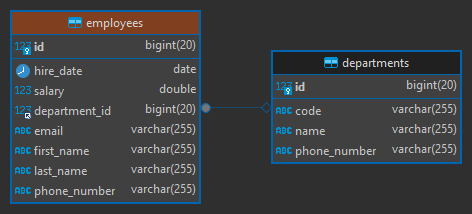

# [Dynamic Query with Specification Interface in Spring Data JPA](https://medium.com/@bubu.tripathy/dynamic-query-with-specification-interface-in-spring-data-jpa-ae8764e32162)

- Tutorial tomado de la página web **medium** del autor **Bubu Tripathy**
- Spring: [Specifications](https://docs.spring.io/spring-data/jpa/reference/jpa/specifications.html)
- Proyecto donde se usa **specifications**:
  [spring-boot-web-crud](https://github.com/magadiflo/spring-boot-web-crud.git)

---

## Dependencias

````xml
<!--Spring Boot 3.2.3-->
<!--Java 21-->
<dependencies>
    <dependency>
        <groupId>org.springframework.boot</groupId>
        <artifactId>spring-boot-starter-data-jpa</artifactId>
    </dependency>
    <dependency>
        <groupId>org.springframework.boot</groupId>
        <artifactId>spring-boot-starter-web</artifactId>
    </dependency>

    <dependency>
        <groupId>org.hibernate.orm</groupId>
        <artifactId>hibernate-jpamodelgen</artifactId>
    </dependency>
    <dependency>
        <groupId>com.mysql</groupId>
        <artifactId>mysql-connector-j</artifactId>
        <scope>runtime</scope>
    </dependency>
    <dependency>
        <groupId>org.projectlombok</groupId>
        <artifactId>lombok</artifactId>
        <optional>true</optional>
    </dependency>
    <dependency>
        <groupId>org.springframework.boot</groupId>
        <artifactId>spring-boot-starter-test</artifactId>
        <scope>test</scope>
    </dependency>
</dependencies>
````

## Propiedades

````yaml
server:
  port: 8080
  error:
    include-message: always

spring:
  application:
    name: spring-data-jpa-specifications

  datasource:
    url: jdbc:mysql://localhost:3306/db_spring_data_jpa
    username: admin
    password: magadiflo

  jpa:
    hibernate:
      ddl-auto: create-drop
    properties:
      hibernate:
        format_sql: true

logging:
  level:
    org.hibernate.SQL: DEBUG
````

## Entidades

````java

@NoArgsConstructor
@AllArgsConstructor
@Builder
@Data
@Entity
@Table(name = "departments")
public class Department {
    @Id
    @GeneratedValue(strategy = GenerationType.IDENTITY)
    private Long id;
    private String code;
    private String name;
    private String phoneNumber;
}
````

````java

@NoArgsConstructor
@AllArgsConstructor
@Builder
@Data
@Entity
@Table(name = "employees")
public class Employee {
    @Id
    @GeneratedValue(strategy = GenerationType.IDENTITY)
    private Long id;
    private String firstName;
    private String lastName;
    private String email;
    private String phoneNumber;
    private LocalDate hireDate;
    private Double salary;

    @ManyToOne
    @JoinColumn(name = "department_id")
    private Department department;
}
````

## Tablas generadas



## Repositorios

````java
public interface IDepartmentRepository extends JpaRepository<Department, Long> {
}
````

````java
public interface IEmployeeRepository extends JpaRepository<Employee, Long> {
}
````

## Servicios

````java
public interface IDepartmentService {
    List<Department> getAllDepartment();

    Optional<Department> getDepartment(Long departmentId);
}
````

````java

@RequiredArgsConstructor
@Slf4j
@Service
public class DepartmentServiceImpl implements IDepartmentService {

    private final IDepartmentRepository departmentRepository;

    @Override
    @Transactional(readOnly = true)
    public List<Department> getAllDepartment() {
        return this.departmentRepository.findAll();
    }

    @Override
    @Transactional(readOnly = true)
    public Optional<Department> getDepartment(Long departmentId) {
        return this.departmentRepository.findById(departmentId);
    }
}
````

````java
public interface IEmployeeService {
    List<Employee> getAllEmployees();

    Optional<Employee> getEmployee(Long employeeId);
}
````````

````java

@RequiredArgsConstructor
@Slf4j
@Service
public class EmployeeServiceImpl implements IEmployeeService {

    private final IEmployeeRepository employeeRepository;

    @Override
    @Transactional(readOnly = true)
    public List<Employee> getAllEmployees() {
        return this.employeeRepository.findAll();
    }

    @Override
    @Transactional(readOnly = true)
    public Optional<Employee> getEmployee(Long employeeId) {
        return this.employeeRepository.findById(employeeId);
    }
}
````

## Rest Controllers

````java

@RequiredArgsConstructor
@RestController
@RequestMapping(path = "/api/v1/departments")
public class DepartmentRestController {

    private final IDepartmentService departmentService;

    @GetMapping
    public ResponseEntity<List<Department>> getAllDepartment() {
        return ResponseEntity.ok(this.departmentService.getAllDepartment());
    }

    @GetMapping(path = "/{departmentId}")
    public ResponseEntity<Department> getDepartment(@PathVariable Long departmentId) {
        return this.departmentService.getDepartment(departmentId)
                .map(ResponseEntity::ok)
                .orElseGet(() -> ResponseEntity.notFound().build());
    }
}
````

````java

@RequiredArgsConstructor
@RestController
@RequestMapping(path = "/api/v1/employees")
public class EmployeeRestController {

    private final IEmployeeService employeeService;

    @GetMapping
    public ResponseEntity<List<Employee>> getAllEmployees() {
        return ResponseEntity.ok(this.employeeService.getAllEmployees());
    }

    @GetMapping(path = "/{employeeId}")
    public ResponseEntity<Employee> getEmployee(@PathVariable Long employeeId) {
        return this.employeeService.getEmployee(employeeId)
                .map(ResponseEntity::ok)
                .orElseGet(() -> ResponseEntity.notFound().build());
    }
}
````
